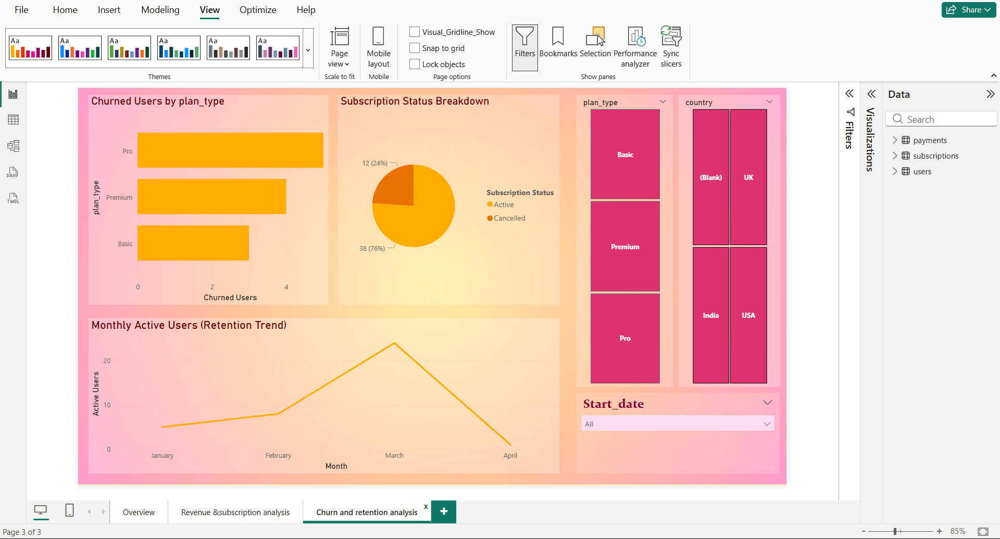
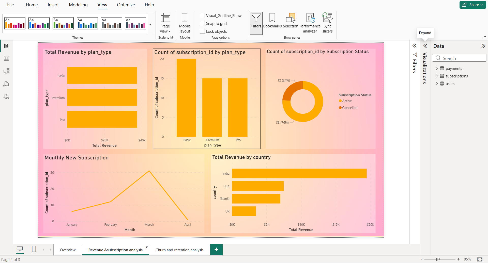

# SaaS Subscription Analysis 📊

## Project Overview
This project analyzes a SaaS business using SQL and Power BI to track revenue, customer growth, and churn.

## Tools Used
- MySQL
- Power BI
- DAX

## Key Metrics
- Total Revenue
- Monthly Recurring Revenue (MRR)
- Average Revenue Per User (ARPU)
- Churn Rate

## Dashboards
### 1. Overview
- Revenue KPIs
- Monthly revenue trend
- Revenue by subscription plan

### 2. Revenue & Subscription Analysis
- Revenue by plan type
- Revenue by country
- New subscriptions by month

### 3. Churn & Retention Analysis
- Churned users by plan
- Active vs cancelled subscriptions
- Monthly active users trend

## Key Insights
- Pro and Premium plans contribute the highest revenue
- Churn varies significantly by subscription plan
- Revenue shows steady growth over time

## Files
- PowerBI/ → Power BI dashboard (.pbix)
- SQL/ → SQL queries used for analysis
- Screenshots/ → Dashboard visuals

## Dashboard Preview

 ![SaaS-Subscription-Analysis]/(Overview.png).
